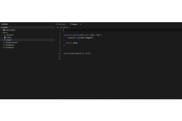
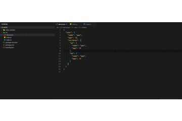
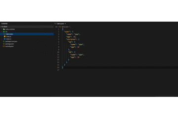

# JSON转换成typescript的interface

## 特色

1. 从剪切板json数据转换成interface  (windows: `ctrl+alt+C ` , Mac : `^+⌥+C`)

2. 选择json数据转换成interface (windows: `ctrl+alt+S ` , Mac : `^+⌥+S`)

3. 将json文件转换成interface   (windows: `ctrl+alt+F ` , Mac : `^+⌥+F`)

